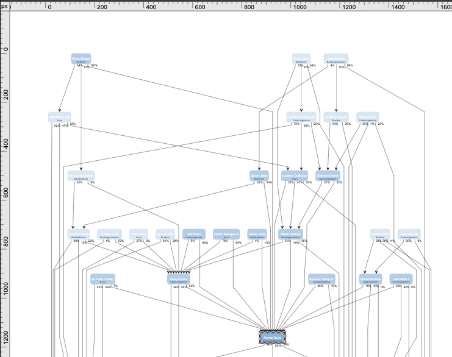

# yFiles Rulter

Besides being a good starter project this includes a re-usable ruler. No framework is used aside from TypeScript and WebPack.
The `randomGraph.ts` file contains various algorithms to generate graphs, which can also be useful for prototyping things.

## Setup

- You need a license to run this project, see [the yWorks website](https://my.yworks.com) for a trial. Insert the license in the `app/scripts/app.ts` file.
- Make sure the path to the yFiles `yfiles-*.tgz` file is set in `package.json`.
- Install things as usual with `npm i`.
- Run it with `npm start`.

## Info and Support

Info and support [@TheOrbifold](https://twitter.com/theorbifold). 
